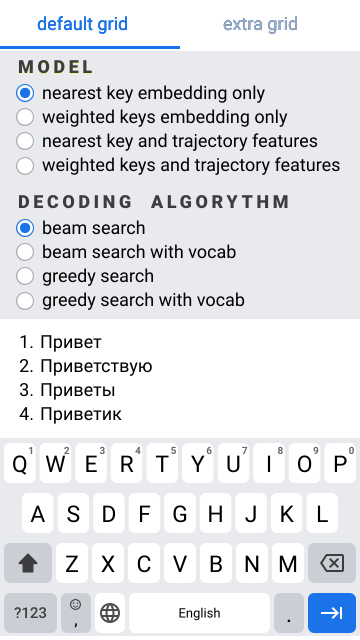

the code is ugly, but it works


TODO:
* Refactor
* Add radiobuttons to choose model and decoding algorythm; add grid choice
    * Выбрать раскладку
    * Выбрать модель (модель = архитектура + метод предобработки данных + веса)
        * У модели можно вывести
            * график обучения с точкой на графике, соответствующей эпохе
            * значениия метрик на валидации
    * Выбрать метод декодирования (bs with voc, bs no voc, greedy voc, greedy no voc)
* Leave swipepoints connected with lines on screen until new  mousedown or touchstart event happens
* Add icons


Prepare:
``` sh
git clone https://github.com/proshian/yandex-cup-2023-ml-neuroswipe.git
cd yandex-cup-2023-ml-neuroswipe
# git checkout embeding_experiments
git checkout c5e0a83eb962a68d6be1a6959b5e94ba178205b2
cd ..
```

Run locally: 

``` sh
python main.py
```


If you are trying to run this on pythonanywhere:

1. Your /var/www/{USERNAME}_pythonanywhere_com_wsgi.py file should look like this
``` python
# This file contains the WSGI configuration required to serve up your
# web application at http://<your-username>.pythonanywhere.com/
# It works by setting the variable 'application' to a WSGI handler of some
# description.
#
# The below has been auto-generated for your Flask project

import sys

# # add your project directory to the sys.path
PROJECT_HOME = '/home/USERNAME/neuroswipe_inference_js/'
if PROJECT_HOME not in sys.path:
    sys.path = [PROJECT_HOME] + sys.path

neuroswipe_dir_src = PROJECT_HOME + 'yandex-cup-2023-ml-neuroswipe/src'
if neuroswipe_dir_src not in sys.path:
    sys.path = [neuroswipe_dir_src] + sys.path


# import flask app but need to call it "application" for WSGI to work
from main import app as application  # noqa
```

Don't forget to chenge PROJECT_HOME and USERNAME and maybe neuroswipe_dir_src if the name of that repo changed


2. You have to change a block of code in ./yandex-cup-2023-ml-neuroswipe/src/word_generators.py:

Before:
``` python
    def _mask_out_unallowed_ids(self, prefix_ids: List[int], logits: Tensor
                                ) -> Tensor:
        if self.prefix_to_allowed_ids is None:
            return logits
        unallowed_ids = self._get_unallowed_token_ids(prefix_ids)
        logits[torch.tensor(list(unallowed_ids), dtype = torch.int)] = float('-inf')
        return logits
```

After:
``` python
    def _mask_out_unallowed_ids(self, prefix_ids: List[int], logits: Tensor
                                ) -> Tensor:
        if self.prefix_to_allowed_ids is None:
            return logits
        unallowed_ids = self._get_unallowed_token_ids(prefix_ids)
        logits[torch.tensor(list(unallowed_ids), dtype = torch.long)] = float('-inf')
        return logits
```


с точки зрения дизайна приложене планируется таким:

